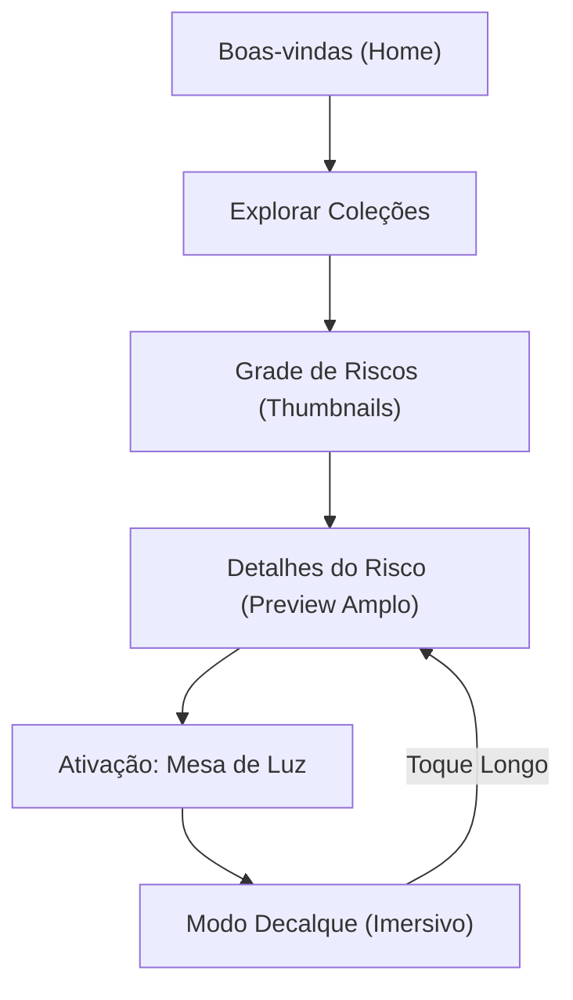

# Design de Interface: Fio & Luz

## 1. Direção Estética: **Luminous Organic**

O projeto "Fio & Luz" exige uma atmosfera que equilibre a **legibilidade extrema** com a **calma tátil** do artesanato. 

- **Aesthetic Direction:** *Luminous Organic* (Luminosidade Orgânica).
- **Inspiração:** Ateliês bem iluminados, papel de arroz, linho lavado e a luz suave da manhã.
- **Diferenciador Visual:** Transições suaves de brilho e espaços negativos generosos que "respiram".

### DFII Score: 14/15
- **Aesthetic Impact:** 4/5 (Diferente da maioria das PWAs "tech").
- **Context Fit:** 5/5 (Ideal para o público 50+ e o tema de luz).
- **Implementation Feasibility:** 4/5 (Uso de CSS moderno para sombras e texturas).
- **Performance Safety:** 5/5 (Minimalista).
- **Consistency Risk:** 1/5 (Sistema simples de 3 estados).

---

## 2. Sistema de Design (Draft)

### Tipografia
- **Display (Títulos):** *Lora* ou *Playfair Display* (Serifada). Traz a sensação de "manual" e "clássico".
- **Body (Leitura):** *Outfit* ou *Plus Jakarta Sans*. Sans-serif moderna com excelente legibilidade e formas arredondadas amigáveis.
- **Escala:** Mínimo de 18px para o corpo do texto. Títulos em escala 1.333 (Perfect Fourth).

### Cores
- **Fundo Base:** `#FCFBF7` (Alabaster - Um branco quente, menos agressivo que o branco puro).
- **Texto Primário:** `#2D2926` (Charcoal - Contraste AAA mas menos cortante que o preto).
- **Acento (Botões/Destaque):** `#8C9DA8` (Dusky Blue) ou `#C18C5D` (Terra-cotta suave).
- **Modo Mesa de Luz:** Base `#FFFFFF` com 100% de brilho, elementos de UI ocultos ou em `#000000` (quando visíveis).

---

## 3. Fluxo de Navegação

## 4. Arquitetura de Informação

A navegação deve ser linear e sem "becos sem saída".

1. **Descoberta:** Scroll vertical infinito de Coleções Temáticas -> Grid de Riscos.
2. **Seleção:** Visualização ampliada do Risco, descrição simples, sugestão de pontos e botão proeminente "Usar como Mesa de Luz".
3. **Mesa de Luz:** Interface imersiva de decalque.

---

## 4. Estrutura do Layout (Wireframe Conceitual)

### Página de Descoberta (Home)
- **Header:** Logotipo centralizado e discreto. Um botão de "Busca" tipo ícone grande à direita.
- **Hero:** Frase de boas-vindas: *"O que vamos bordar hoje?"*.
- **Grid de Coleções:** Cards grandes (aspect ratio 4:5 ou 1:1) com imagens de bordados prontos. Títulos em baixo dos cards, fonte Serif.
- **Filtros (Opcional):** Tags ovais grandes (e.g., "Botânico", "Natal", "Letras") com touch targets de 56px.

### Detalhes do Risco (Pattern Detail)
- **Visual:** Imagem do risco ocupa 60% da tela inicialmente.
- **Informação:** Título grande, lista em bullet points (curta) sobre pontos sugeridos.
- **Chamada para Ação (CTA):** Botão fixo no rodapé (Sticky Bottom) com a cor de acento: **[ INICIAR MESA DE LUZ ]**. Texto em caixa alta (Uppercase) para autoridade visual.

### Interface "Mesa de Luz"
1. **Entrada:** Animação de "fade-to-white" (explosão de luz).
2. **Setup:** Instrução curta: *"Coloque o tecido sobre a tela"*.
3. **Imersão:** 
    - Ativação do Wake Lock (Automático).
    - Ocultar Status Bar e Nav Bar.
    - O Risco centralizado em preto puro (`#000000`) sobre branco (`#FFFFFF`).
4. **Controle de Saída:** Pequeno ícone de "Cadeado" no canto superior esquerdo ou instrução *"Toque longo para sair"*.

---

## 5. Diferenciação: "O Efeito Papel de Arroz"

> "Evitamos UI genérica adicionando uma textura sutil de grão (noise) no fundo da aplicação e usando bordas orgânicas (irregular border-radius) nos botões, imitando o toque humano."

---

## 6. Validação de Acessibilidade (Público 50+)

Para garantir que o design atenda ao público-alvo, aplicamos as seguintes diretrizes:

| Requisito | Implementação no Layout |
| :--- | :--- |
| **Visibilidade** | Contraste AAA (7:1) em todos os textos críticos. Sem fontes "thin". |
| **Touch Targets** | Botões e links com área ativa mínima de 56x56px. |
| **Cognição** | Navegação por abas ou botões grandes; ausência de menus "hambúrguer" escondidos. |
| **Ergonomia** | Botão de ativação principal no terço inferior da tela (zona de fácil alcance). |
| **Prevenção de Erro** | Saída da Mesa de Luz exige interação intencional (evita fechamento acidental). |

---

## 7. Conclusão da Estrutura

Esta estrutura prioriza a intuição e a funcionalidade física do dispositivo como ferramenta. O layout é limpo, evocativo e tecnicamente robusto para suportar as APIs de Wake Lock e Touch Isolation descritas na proposta técnica.
